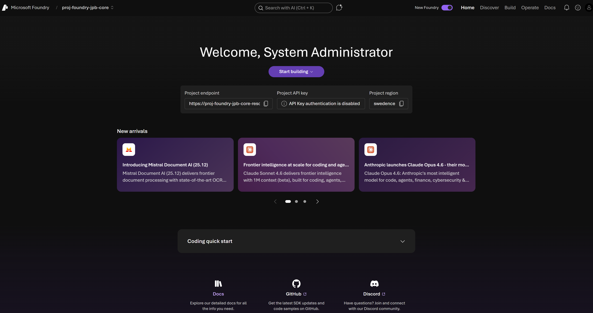
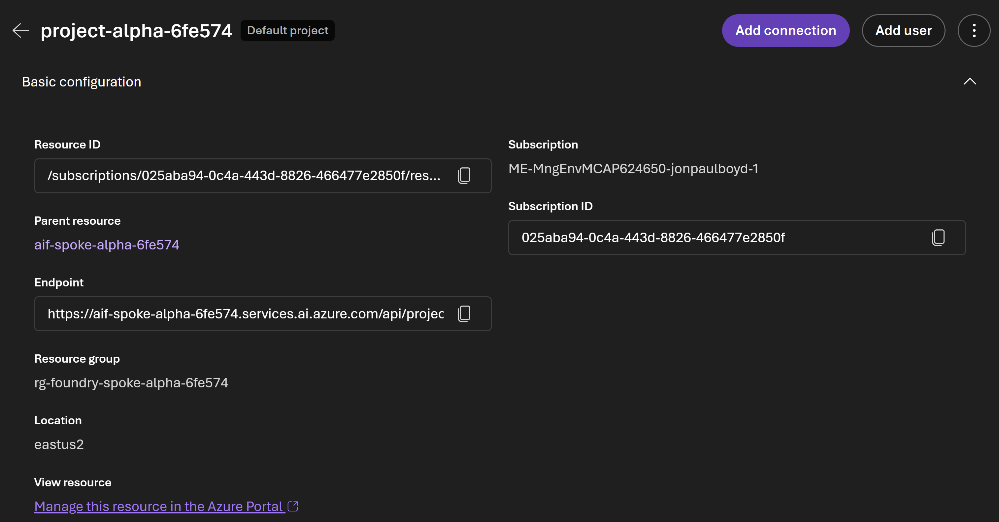
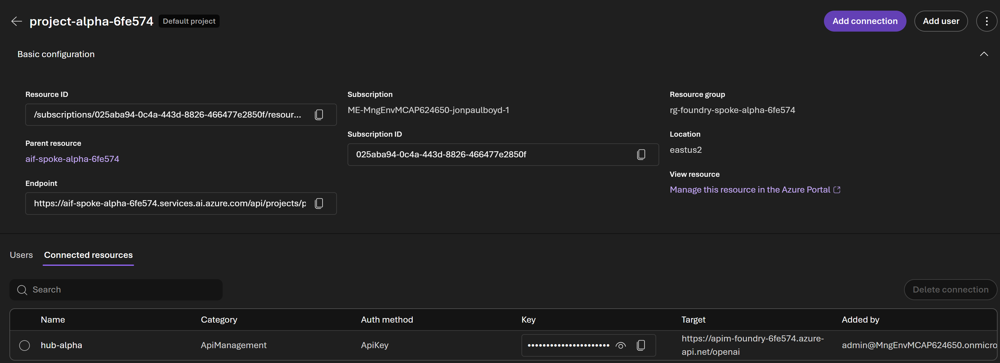
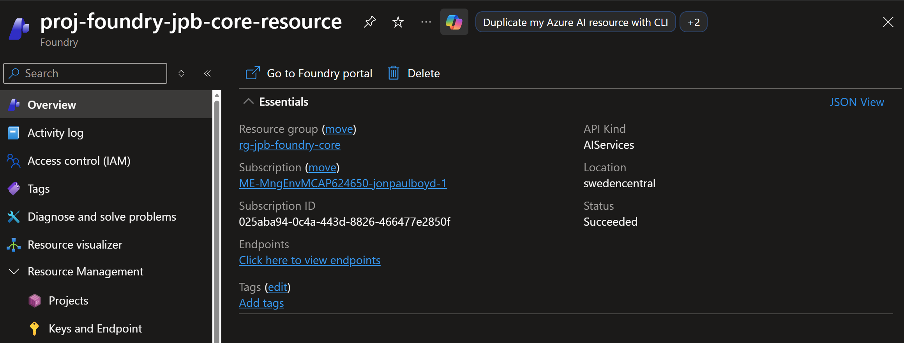

# Foundry portal home page
I've navigated to [ai.azure.com](https://ai.azure.com) and signed in with my Azure account.

Note with the radio button I"ve enabled the foundry next gen experience.

The project I'm currently working on is shown at the top left of the page. You can click here to see a list of projects and switch to another

# Primary Navigation Tabs
You can see the primary navigation tabs along the top right, orientated around jobs to be done.

- **Home**: getting users back to the entry point or back to where they were with recent work.
- [**Discover**](../02-foundry-portal-discover-page/02-00-foundry-portal-discover-page.md): Netflix-style discovery space. Model and capability catalog (search driven)
- [**Build**](../03-foundry-portal-build-page/03-00-foundry-portal-build-page.md): Create agents, apps, and workflows
- **Operate**: Admin and decision-maker view across subscriptions and projects
- **Docs**: integrated documentation experience meant to keep users *in context*

New arrivals include highlighting the latest launched models.

Further down, you have the recent work section, for example a workflow or agent you worked on yesterday, so you can easily get back to it.

Then an example quickstart code snippet.

There is a search bar for searching the catalog under the discover experience, or asking Ask AI, which has multiple agents behind the scenes, one grounded on docs, others that can deploy things.

There is a bell icon for the notification centre, for example notifying a user fine tuning of a model is complete.

> [!NOTE]
> This next gen Foundry portal will not display assets created in the classic Foundry portal.

# Foundry Project Basic Configuration
You can also view the basic configuration of a project:

And view the project connected resources, for example to APIM:

# Foundry Resource
Each project sits inside a Foundry resource, which is provisioned into an Azure subscription and resource group - the billing, management, and governance boundaries introduced in the previous section.

---

[Next: Foundry portal discover page →](../02-foundry-portal-discover-page/02-00-foundry-portal-discover-page.md)

