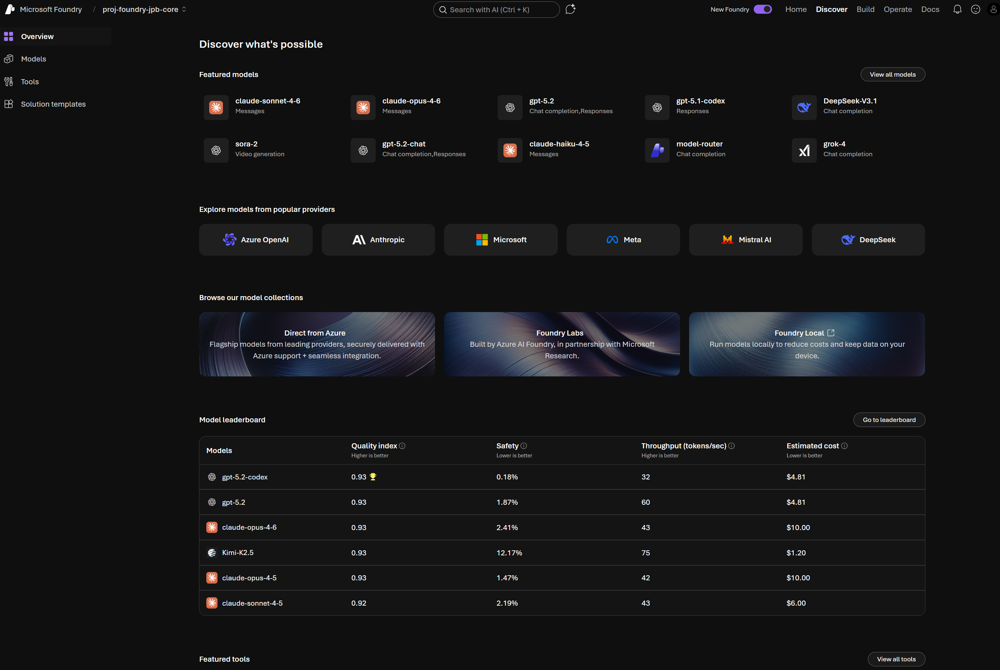
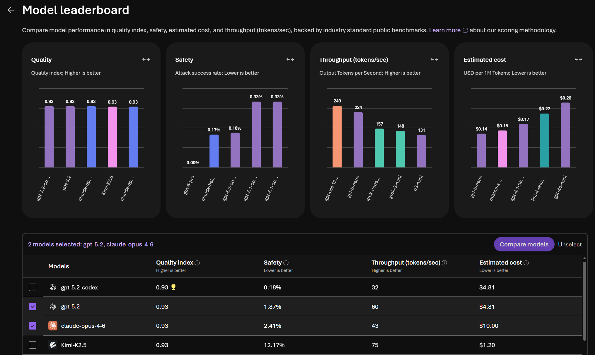

# Foundry portal discover page
The *discover* page is a Netflix-style discovery space for models and agents. It has a models and capabilities catalog which can be search driven.

# Overview
A mix of all our Foundry assets, including:
- **featured models** including the most popular.
- **explore models from different providers** and collections.
- **model leaderboard** to check models when thinking about optimising for quality, safety, throughput, and cost.
- **compare models** by selecting more than one from the leaderboard, then clicking *compare models* to get a side-by-side view.
- **featured tools**

# Models View
Allows you to:
- Look at all the models.
- Search for models.
- Select a model and look at the model card.
- Model recommendation (which other models other users are using).
- Deploy models, including quick deploy (global standard).

# Tools View
Foundry Tools is the place to discover and manage tools you use with agents and workflows in Microsoft Foundry. Foundry provides both Foundry Tools (a curated public catalog of tools for building agents) and private tool catalogs (organization-scoped, for tools only visible within your organization).

You can use Foundry Tools to:
- Discover tools such as Model Context Protocol (MCP) servers and built-in tools.
- Configure tools once, then add them to agents or workflows.
- Filter, search, and sort tools.

Note: to use Foundry tools, you need:
- Access to a Foundry project in the Foundry portal.
- Permission to view and manage tools in that project.

## Key concepts

| Term | Meaning |
|---|---|
| Foundry Tools | The portal experience where you discover, configure, and manage tools for agents and workflows. |
| Tool catalog | The browsable list of available tools (public and organizational). |
| Private tool catalog | An organization-scoped catalog for tools that only users in your organization can discover and configure. |
| MCP server | A server that exposes tools using the Model Context Protocol (MCP). |
| Remote MCP server | An MCP server hosted by the publisher. You configure it by providing the required settings (for example, an endpoint and authentication details). |
| Local MCP server | An MCP server you host yourself, then connect to Foundry by providing its remote endpoint. |
| Custom tool | A tool you add by providing your own endpoint or specification (for example, an MCP endpoint, an OpenAPI spec, or Agent-to-Agent (A2A) endpoints). |

## Tool types

Foundry Tools includes three types of tool catalog entries:

| Type | Description |
|---|---|
| **Remote MCP server** | The MCP server publisher has already hosted the server and provided a static or dynamic MCP server endpoint. Foundry developers follow the configuration guidance to provide the appropriate information and finish the setup. |
| **Local MCP server** | The publisher doesn't host the server. You host it, then connect it to Foundry by providing its endpoint. To build and register your own server, see [Build and register a Model Context Protocol (MCP) server](https://learn.microsoft.com/en-us/azure/foundry/mcp/build-your-own-mcp-server). To connect an MCP endpoint to an agent, see [Connect to Model Context Protocol servers](https://learn.microsoft.com/en-us/azure/foundry/agents/how-to/tools/model-context-protocol?pivots=python). |
| **Custom** | These MCP servers are converted from Azure Logic App Connectors. Foundry developers need additional [configuration](https://aka.ms/FoundryCustomTool) to convert them to remote MCP servers. |

## Filters

Foundry Tools provides the following filters to help you find the right tools for your agents:

| Filter | Description |
|---|---|
| Publisher | Microsoft or non-Microsoft publisher |
| Category | Categories such as databases, analytics, web, and more |
| Registry | **Public**: Public remote and local MCP servers in the catalog. **Logic Apps connectors**: Azure Logic Apps connectors that you convert to remote MCP servers for use in a private tool catalog. |
| Supported authentication | Authentication method an MCP server supports. For more information, see Authentication methods. |

# Featured solution templates

Solution templates are step-by-step, production-ready AI application templates you can review, clone into your own environment, or open directly on GitHub. Each template is deployed via the Azure Developer CLI (`azd up`) and combines Foundry Agent Service, Azure OpenAI, and supporting Azure services.

## Available templates

| Template | Description | Foundry assets | GitHub |
|---|---|---|---|
| **Get Started with AI Agents** | Web-based chat app powered by Foundry Agent Service with file search and knowledge retrieval from uploaded documents. | Foundry Agent Service, model deployment (gpt-4o-mini), file search tool, Azure AI Search (optional) | [Azure-Samples/get-started-with-ai-agents](https://github.com/Azure-Samples/get-started-with-ai-agents) |
| **Get Started with AI Chat** | RAG-pattern chat web app using Azure AI Foundry SDKs. Good starting point for employee chatbots and contact centre support. | Model deployments (gpt-4o-mini, text-embedding-ada-002), Azure AI Search | [Azure-Samples/get-started-with-ai-chat](https://github.com/Azure-Samples/get-started-with-ai-chat) |
| **Process Multi-Modal Content** | Extracts and structures data from unstructured documents (text, images, tables). Supports claims, invoice, contract, and ID verification use cases. Includes confidence scoring and human-review flagging. | Model deployments (GPT-4o, GPT-4o mini, o1, o1-mini, o3-mini), Azure AI Content Understanding | [microsoft/content-processing-solution-accelerator](https://github.com/microsoft/content-processing-solution-accelerator) |
| **Unlock Insights from Conversational Data** | Derives insights from large volumes of call centre or helpdesk conversations. Performs topic modelling, key phrase and entity extraction, and supports natural language querying over the results. | Model deployment, Foundry IQ (knowledge base), Azure AI Content Understanding | [microsoft/Conversation-Knowledge-Mining-Solution-Accelerator](https://github.com/microsoft/Conversation-Knowledge-Mining-Solution-Accelerator) |
| **Generate Documents from Your Data** | Automates document generation from structured data using Azure OpenAI and Azure AI Search. Use cases include client meeting prep and shopping assistance. | Model deployment, Azure AI Search | [microsoft/document-generation-solution-accelerator](https://github.com/microsoft/document-generation-solution-accelerator) |
| **Build Your Conversational Agents** | Reference implementation for building custom copilots and conversational agents using Azure AI Foundry. | Model deployment, Azure AI Search | [microsoft/Build-your-own-copilot-Solution-Accelerator](https://github.com/microsoft/Build-your-own-copilot-Solution-Accelerator) |
| **Automate Multi-Agent Workflows** | Multi-agent orchestration system where users specify tasks and a coordinated group of specialised agents executes them. Use cases include employee onboarding, travel booking, and supply chain planning. | Model deployment, multiple Semantic Kernel agents, Azure AI Search | [microsoft/Multi-Agent-Custom-Automation-Engine-Solution-Accelerator](https://github.com/microsoft/Multi-Agent-Custom-Automation-Engine-Solution-Accelerator) |
| **Modernize Your Code with Agents** | AI agents that migrate and modernise SQL queries and code across environments. | Model deployment, multiple Semantic Kernel agents (Translator, Validator, Optimizer) | [microsoft/Modernize-your-code-solution-accelerator](https://github.com/microsoft/Modernize-your-code-solution-accelerator) |
| **Generate Marketing Content** | AI-powered marketing content creation using multiple specialised agents (Triage, Planning, Research, Content, Compliance) to generate and validate text and images against brand guidelines. | Model deployments (GPT, image generation), Microsoft Agent Framework (5 specialised agents), Azure AI Search | [microsoft/content-generation-solution-accelerator](https://github.com/microsoft/content-generation-solution-accelerator) |
| **Deploy Your AI Application in Production** | Reference architecture for transitioning an AI proof-of-concept to a secure, scalable production environment with networking, RBAC, and monitoring. | Model deployment, Foundry Prompt Flow, Azure AI Search, private endpoints, managed identity, RBAC | [microsoft/Deploy-Your-AI-Application-In-Production](https://github.com/microsoft/Deploy-Your-AI-Application-In-Production) |

## Resources

- [AI App Templates overview](https://learn.microsoft.com/en-us/azure/developer/ai/intelligent-app-templates) - full browsable gallery on Microsoft Learn
- [Azure AI Solution Accelerators list](https://github.com/Azure/ai-solution-accelerators-list) - index of all accelerators on GitHub

---

[Next: Foundry portal build page →](../03-foundry-portal-build-page/03-00-foundry-portal-build-page.md)
