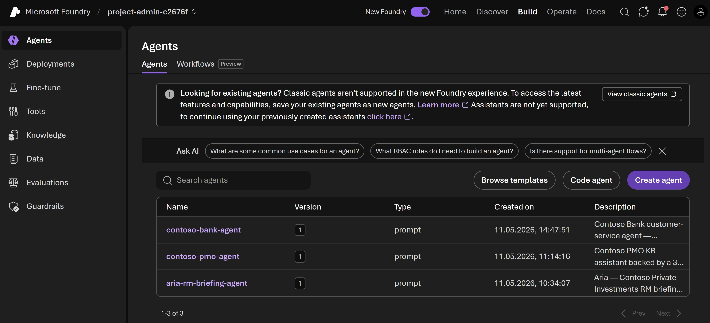

# Foundry portal build page
Think of build as the control plane for developers for manage all the assets they have interacted with, created, or deployed. If you deployed a model, created an agent, developed a workflow, or fine-tuned a model, it will appear here.

What you see in the **build** view are the core building blocks of an agent.

Build is also the place where playgrounds live.

> **Note:** Foundry (new) only supports V2 agents. Use the agent builder to create and manage agents.

[Next: Create a Foundry project →](03-01-create-foundry-project.md)