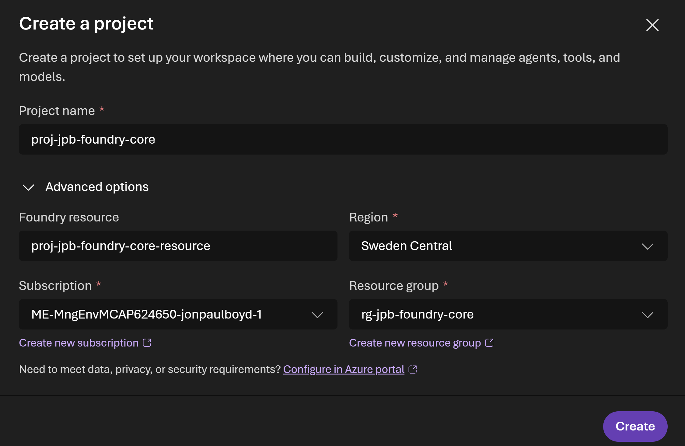

# Introduction

A foundry project is the workspace that organises all your agentic application assets — models, agents, tools, knowledge bases, and workflows — under a single resource with shared access controls and networking. 

A Foundry project is a team- or workload-scoped workspace that organises all your agentic application assets — models, agents, tools, knowledge bases, and workflows — under a single resource with shared access controls and networking. 

It sits inside a Foundry resource, inheriting its networking and governance configuration, while keeping its agents, data, and connections isolated from other projects on the same account.

Before you can deploy any of these things, you need to create a Foundry project.

Navigate to ai.azure.com and select *Create new project*

