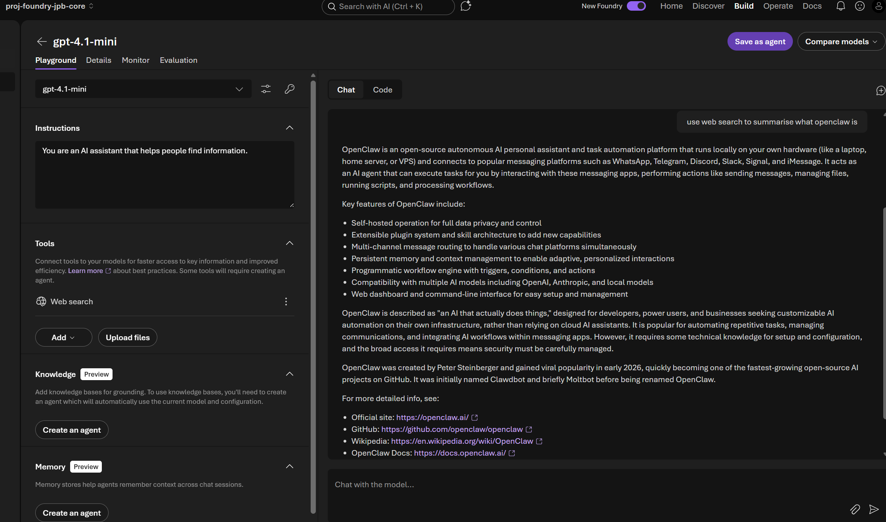

# How to create a new model
You can use the Foundry UI to deploy a model in a Foundry project for inference. Models like gpt-4.1-mini for text responses, and gpt-image-1.5 for text to image.

After you deploy a Foundry Model, you can interact with it in the Foundry Playground and use it from code.

To deploy a model you need the Cognitive Services Contributor role or equivalent permissions on the Foundry resource to create and manage deployments. 

When you deploy a model, you can choose *default settings* to default to a global standard deployment with default quota, or customize the deployment to select your own sku, quota, and guardrails.

Note for Foundry Models from partners and community, like the Llama series, you need to subscribe to Azure Marketplace. 

For Foundry Models sold directly by Azure, such as the Azure OpenAI model gpt-4o-mini, you don't subscribe to Azure Marketplace.

Note each model supports different deployment types, providing different data residency or throughput guarantees.

# Regional availability and quota limits of a model
For Foundry Models, the default quota varies by model and region. Certain models might only be available in some regions, see [here](https://learn.microsoft.com/en-us/azure/ai-foundry/foundry-models/concepts/models-sold-directly-by-azure).

# Test the deployment in the playground

You can interact with the new model in the Foundry portal by using the playground. The playground is a web-based interface that lets you interact with the model in real-time. Use the playground to test the model with different prompts and see the model's responses.

## Model Deployment tabs

### Playground
The first tab is the playground which allows you to select the model from the drop down. You can also adjust the model parameters like number of past messages included, max tokens, and temperature.

Here you can add a system prompt like *You are an AI assistant that helps people find information*.

#### Adding tools
You can connect tools to your model, to extend what your model can work with, like retrieving information from sharepoint, adding a code interpretor to create a bar graph from excel data, or web search to ground the model in the latest online information.

#### Adding knowledge and memory
You need to create an agent for adding knowledge and memory. The agent will use the current model and configuration.

# Details View
- Shows the model target URI and API key (if enabled).
- Model name and deployment type, provisioning state
- TPM (Tokens Per Minute) and RPM (Requests Per Minute) rate limits

# Monitor View
By time window (e.g., custom date range, last day, last 7 days, last month), metrics for:

- Total requests
- Total token count
- Estimated total cost
- Input token count
- Output token count
- Time to first byte

Note you can use Ask AI for some canned queries on metrics.

# Resources
[Deploy a Foundry model with code](https://learn.microsoft.com/en-us/azure/ai-foundry/foundry-models/how-to/create-model-deployments?view=foundry&pivots=programming-language-cli)

