# Architecture

## Overview

This section series deploys a **centralised AI gateway pattern**: a single BYO (Bring Your Own) API Management instance acts as the entry point for all model traffic, routing requests to multiple regional Foundry accounts based on the model being called. Teams access this gateway through their own Foundry project workspaces, each authenticated with a dedicated APIM subscription key for independent rate limiting and usage tracking.

Two Foundry provisioning patterns are demonstrated side-by-side:

- **1:1 Spoke** - Team Alpha has its own dedicated Foundry account, giving it a hard infrastructure boundary. This suits teams with strict compliance or cost isolation requirements.
- **1:N Multi-Project** - Teams Beta, Delta, and Gamma share a single Foundry account with project-level isolation. This is the preferred pattern for teams in the same department or cost centre.

Neither pattern changes how teams reach the gateway or which models they can use - that is determined entirely by their project connection and APIM subscription.

---

## Component inventory

> **Resource name suffix:** Resource names below include `{suffix}` - first 6 characters of `sha256(subscription_id + 'v2')`, computed by the lab notebooks and passed as a parameter to every Bicep template. Stable for a given subscription; bump the `'v2'` salt to force a clean redeploy under new names.

> **Team naming convention:** Greek letters (Alpha, Beta, Delta, Gamma) are used exclusively as **team identifiers** - they denote application teams, not capabilities or workloads. Capability-specific resources take a descriptive qualifier instead (e.g. `hosted`, `memory`) rather than a new Greek letter. A new Greek name would imply a new team exists, which would be misleading. The APIM connection on a team's project always follows `core-{team}` (e.g. `core-alpha`).

### Landing zone: `rg-foundry-core-{suffix}`

The shared infrastructure backbone. All team projects route model requests through this resource group.

| Resource | Type | Region | `.env` key | Purpose |
|----------|------|--------|------------|---------|
| `apim-foundry-{suffix}` | API Management BasicV2 | East US 2 | `GATEWAY_URL` | Central gateway - single URL for all model access |
| `aif-core-{suffix}` | Foundry Account (AI Services) | East US 2 | `CORE_ENDPOINT` | Primary core: general purpose and routing models |
| `project-admin-{suffix}` | Foundry Project (child of `aif-core`) | East US 2 | `ADMIN_FOUNDRY_PROJECT_ENDPOINT` | Admin project: hosts centrally-managed agents, evaluations, observability, and load-gen workloads |
| `aif-research-{suffix}` | Foundry Account (AI Services) | Norway East | - | Research hub: advanced reasoning models |
| `aif-oss-{suffix}` | Foundry Account (AI Services) | West US 3 | - | OSS hub: open-weights models |
| `stfoundry{suffix}` | Storage Account | East US 2 | - | Shared storage |

> [!IMPORTANT]
> **APIM SKU and private Foundry resources**
>
> The Foundry AI Gateway feature requires APIM in a v2 tier - **BasicV2**, **StandardV2**, or **PremiumV2**. BasicV2 is used here as the cost-effective option for public Foundry resources.
>
> **If the Foundry resource has public network access disabled, BasicV2 is not sufficient.** BasicV2 does not support private endpoints, so APIM cannot reach a private Foundry resource. In that case, switch to:
>
> - **StandardV2** or **PremiumV2** with a private endpoint, or
> - **PremiumV2** injected into a virtual network.
>
> Microsoft Learn quote - [Configure AI Gateway in your Foundry resources](https://learn.microsoft.com/en-us/azure/foundry/configuration/enable-ai-api-management-gateway-portal):
>
> > "If your Foundry resource has public network access disabled, make sure that your API Management instance is also privately accessible to integrate with your private Foundry resource. In this case, use a Standard v2 or Premium v2 instance with a private endpoint, or a Premium v2 instance that's injected in a virtual network."

**Model deployments:**

| Model | Foundry Account | Region | SKU | `.env` key | Purpose |
|-------|----------------|--------|-----|------------|---------|
| `gpt-4.1-mini` | `aif-core-{suffix}` | East US 2 | GlobalStandard 30K TPM | `CHAT_MODEL` | General purpose chat |
| `text-embedding-3-large` | `aif-core-{suffix}` | East US 2 | Standard 50K TPM | `EMBEDDING_MODEL` | Vector embeddings |
| `o3-deep-research` | `aif-research-{suffix}` | Norway East | GlobalStandard 10K TPM | `RESEARCH_MODEL` | Advanced reasoning and deep research |
| `Phi-4` | `aif-oss-{suffix}` | West US 3 | GlobalStandard 1K TPM | `OSS_MODEL` | Open-weights model from Microsoft |

**APIM routing rules** (evaluated in order - specific URL patterns win over the default):

| Rule | URL pattern | Backend | Auth |
|------|------------|---------|------|
| Research | `/deployments/o3-deep-research/*` | `aif-research-{suffix}` | Managed Identity |
| OSS | `/deployments/Phi-4/*` | `aif-oss-{suffix}` | Managed Identity |
| Default | all other `/deployments/*` | `aif-core-{suffix}` | Managed Identity |

**APIM subscriptions** (one per consumer for independent rate limiting):

| Subscription name | Scope | `.env` key | Used by |
|-------------------|-------|------------|---------|
| `foundry-gateway-alpha` | `openai` API | `ALPHA_GATEWAY_KEY` | Team Alpha |
| `foundry-gateway-beta` | `openai` API | `BETA_GATEWAY_KEY` | Team Beta |
| `foundry-gateway-delta` | `openai` API | `DELTA_GATEWAY_KEY` | Team Delta |
| `foundry-gateway-gamma` | `openai` API | `GAMMA_GATEWAY_KEY` | Team Gamma |
| `foundry-gateway-iq` | `openai` API | `IQ_GATEWAY_KEY` | Foundry IQ - isolated from team quotas; the embedding batch ingest for 3,000 documents generates ~6M tokens and must not compete with team traffic |
| `foundry-gateway-contoso-pmo` | `openai` API | `CONTOSO_PMO_GATEWAY_KEY` | Contoso PMO KB - dedicated MCP server workload; avoids competing with team inference traffic |
| `foundry-gateway-cu` | `openai` API | `CU_GATEWAY_KEY` | Content Understanding - dedicated CU workload quota; also gates access to the `/cu` APIM API |
| `foundry-gateway-obs` | `openai` API | `OBS_GATEWAY_KEY` | Agent Observability - dedicated APIM subscription isolates tracing workload quota from team traffic |

---

### Team Alpha spoke: `rg-foundry-spoke-alpha-{suffix}` (1:1 pattern)

Team Alpha has a dedicated Foundry account with no local model deployments - all inference is handled by the core gateway.

| Resource | Type | Region | `.env` keys |
|----------|------|--------|-------------|
| `aif-spoke-alpha-{suffix}` | Foundry Account | East US 2 | `ALPHA_FOUNDRY_ACCOUNT`, `ALPHA_FOUNDRY_ENDPOINT` |
| `project-alpha-{suffix}` | Foundry Project | East US 2 | `ALPHA_FOUNDRY_PROJECT`, `ALPHA_FOUNDRY_PROJECT_ENDPOINT` |

Connection: `core-alpha` (`ALPHA_FOUNDRY_CORE_CONNECTION`) → `apim-foundry-{suffix}` (key: `ALPHA_GATEWAY_KEY`)

Model access via connection: `core-alpha/gpt-4.1-mini`

---

### Teams Beta, Delta, Gamma + Foundry IQ Multi-Agent + Foundry IQ + Contoso PMO KB + Agent Observability: `rg-foundry-multi-{suffix}` (1:N pattern)

Three teams share one Foundry account (`aif-spoke-multi-{suffix}`). Project-level isolation ensures each team's agents and data remain separate. Foundry IQ Multi-Agent extends this account with a `contoso-project` and a dedicated Standard SKU Azure AI Search service; Foundry IQ extends this account with a fourth project (`iq-project`) and a dedicated Azure AI Search service; Contoso PMO KB adds a fifth project (`contoso-pmo-project`) for the custom MCP server workload; Agent Observability adds a sixth project (`obs-project`) with Application Insights - all demonstrating the 1:N pattern absorbing successive capability workloads without creating new Foundry accounts.

| Resource | Type | `.env` keys | Added by |
|----------|------|-------------|----------|
| `aif-spoke-multi-{suffix}` | Foundry Account (shared) | `MULTI_ACCOUNT`, `MULTI_ACCOUNT_ENDPOINT` | Multi-project deployment |
| `project-beta-{suffix}` | Foundry Project - Team Beta | `BETA_FOUNDRY_PROJECT`, `BETA_FOUNDRY_PROJECT_ENDPOINT` | Multi-project deployment |
| `project-delta-{suffix}` | Foundry Project - Team Delta | `DELTA_FOUNDRY_PROJECT`, `DELTA_FOUNDRY_PROJECT_ENDPOINT` | Multi-project deployment |
| `project-gamma-{suffix}` | Foundry Project - Team Gamma | `GAMMA_FOUNDRY_PROJECT`, `GAMMA_FOUNDRY_PROJECT_ENDPOINT` | Multi-project deployment |
| `contoso-project` | Foundry Project - Foundry IQ Multi-Agent | `CONTOSO_FOUNDRY_PROJECT`, `CONTOSO_FOUNDRY_PROJECT_ENDPOINT` | Foundry IQ Multi-Agent |
| `contoso-search-{suffix}` | Azure AI Search (Standard, SystemAssigned identity) | `CONTOSO_SEARCH_ENDPOINT`, `CONTOSO_SEARCH_NAME` | Foundry IQ Multi-Agent |
| `iq-project` | Foundry Project - Foundry IQ | `IQ_FOUNDRY_PROJECT`, `IQ_FOUNDRY_PROJECT_ENDPOINT` | Foundry IQ |
| `contoso-pmo-project` | Foundry Project - Contoso PMO KB | `CONTOSO_PMO_FOUNDRY_PROJECT`, `CONTOSO_PMO_FOUNDRY_PROJECT_ENDPOINT` | Contoso PMO KB |
| `iq-search-{suffix}` | Azure AI Search (Basic, SystemAssigned identity) | `IQ_SEARCH_ENDPOINT`, `IQ_SEARCH_NAME` | Foundry IQ |
| `obs-project` | Foundry Project - Agent Observability | `OBS_FOUNDRY_PROJECT_ENDPOINT` | Agent Observability |
| `log-obs-{suffix}` | Log Analytics Workspace | - | Agent Observability |
| `appi-obs-{suffix}` | Application Insights | `OBS_APP_INSIGHTS_NAME`, `OBS_APP_INSIGHTS_CONN_STRING` | Agent Observability |

Each project connects to the gateway via its own named APIM connection and key:

| Project | Connection | Connection `.env` key | Gateway key |
|---------|-----------|----------------------|-------------|
| `project-beta-{suffix}` | `core-beta` | `BETA_FOUNDRY_CORE_CONNECTION` | `BETA_GATEWAY_KEY` |
| `project-delta-{suffix}` | `core-delta` | `DELTA_FOUNDRY_CORE_CONNECTION` | `DELTA_GATEWAY_KEY` |
| `project-gamma-{suffix}` | `core-gamma` | `GAMMA_FOUNDRY_CORE_CONNECTION` | `GAMMA_GATEWAY_KEY` |
| `iq-project` | `landing-zone-apim` | `IQ_APIM_CONNECTION` | `IQ_GATEWAY_KEY` |
| `contoso-pmo-project` | `landing-zone-apim` | `CONTOSO_PMO_APIM_CONNECTION` | `CONTOSO_PMO_GATEWAY_KEY` |
| `obs-project` | `landing-zone-apim` | `OBS_APIM_CONNECTION` | `OBS_GATEWAY_KEY` |
| `cu-project` | `landing-zone-apim` | `CU_APIM_CONNECTION` | `CU_GATEWAY_KEY` |

> **Connection naming**: team core connections follow `core-{team}` (e.g. `core-beta`). The `iq-project`, `contoso-pmo-project`, and `obs-project` connections are named `landing-zone-apim` because `iq`, `contoso-pmo`, and `obs` are capability qualifiers, not team names - all three use descriptive connection names that reflect what they are connecting to.

**`iq-search-{suffix}` - Azure AI Search index details (Foundry IQ):**

| Index | Dimensions | Algorithm | Semantic config | KB |
|-------|-----------|-----------|----------------|----|
| `arxiv-nlp` | 3,072 (text-embedding-3-large) | HNSW cosine (m=4, ef_construction=400) | `arxiv-nlp-semantic` | `arxiv-nlp-kb` (low effort), `arxiv-nlp-kb-fast` (minimal) |

The search service's managed identity is granted **Cognitive Services User** on `aif-spoke-multi-{suffix}` so the integrated vectorizer can call `text-embedding-3-large` via APIM at query time. The `iq-project` managed identity is granted **Search Index Data Reader** on `iq-search-{suffix}` for MCP-based KB retrieval.

---

### Content Understanding: `rg-foundry-cu-{suffix}`

Content Understanding requires a **dedicated** AI Services account with local model deployments - it cannot share `aif-spoke-multi-{suffix}`, which has the `deny-model-deployments` policy assigned. A new resource group (`rg-foundry-cu-{suffix}`) is created exclusively for this lab.

| Resource | Type | Region | `.env` keys |
|----------|------|--------|-------------|
| `aif-cu-{suffix}` | Foundry Account (AI Services) | East US 2 | `CU_ACCOUNT_ENDPOINT` |
| `cu-project` | Foundry Project | East US 2 | `CU_FOUNDRY_PROJECT`, `CU_FOUNDRY_PROJECT_ENDPOINT` |
| `gpt-4.1-mini` (local) | Model Deployment on `aif-cu-{suffix}` | East US 2 | used by CU field extraction |
| `text-embedding-3-large` (local) | Model Deployment on `aif-cu-{suffix}` | East US 2 | used by CU embedding |

Connection: `cu-project` → `landing-zone-apim` (`CU_APIM_CONNECTION`) with key `CU_GATEWAY_KEY`

> **Policy exemption**: `rg-foundry-cu-{suffix}` is explicitly **excluded** from the `deny-model-deployments` policy - local model deployments are intentional and required for CU field extraction analyzers. `cu` is a capability qualifier, not a team name.

---

## APIM routing

All model traffic enters through the single APIM gateway (`apim-foundry-{suffix}`). APIM decides which Foundry core account to forward each request to based on **URL pattern matching**: the incoming request path is compared against the `urlTemplate` of each operation defined on the `openai` API, and the most specific match wins.

### How matching works

APIM evaluates operations in specificity order - an exact literal path beats a wildcard path. The `{deployment-id}` placeholder in a `urlTemplate` is a wildcard; a literal model name in the same position is an exact match and always takes priority.

```
POST /deployments/o3-deep-research/chat/completions
  → exact match: operation "chat-research"  → operation policy → openai-research backend

POST /deployments/Phi-4/chat/completions
  → exact match: operation "chat-oss"       → operation policy → openai-oss backend

POST /deployments/gpt-4.1-mini/chat/completions
  → wildcard match: operation "chat"        → no operation policy → falls through to API-level policy → openai backend

POST /deployments/text-embedding-3-large/embeddings
  → wildcard match: operation "embeddings"  → no operation policy → falls through to API-level policy → openai backend

POST /responses
  → exact match: operation "responses"      → no operation policy → falls through to API-level policy → openai backend
```

Operations that have **no operation-level policy** inherit the **API-level (All operations) policy**, which sets the default backend to `openai` (`aif-core-{suffix}`).

### Inbound policy per operation

| APIM operation name | Display name | Has operation-level policy? | Inbound policy action |
|---|---|---|---|
| `chat-research` | Chat Completions (Research) | Yes | `set-backend-service backend-id="openai-research"` + managed identity auth |
| `chat-oss` | Chat Completions (OSS) | Yes | `set-backend-service backend-id="openai-oss"` + managed identity auth |
| `chat` | Chat Completions | No - inherits API-level | API-level: `set-backend-service backend-id="openai"` + managed identity auth + rate limit (100/60s) + default `api-version=2024-10-21` |
| `embeddings` | Embeddings | No - inherits API-level | same as above |
| `responses` | Responses | No - inherits API-level | same as above |

> **Policy naming note:** every APIM policy resource has the name `policy` - it is not a meaningful identifier. What distinguishes policies is which operation (or API) they are attached to. Operations with no policy of their own fall through to the API-level policy attached to "All operations".

### Operation → backend → Foundry account → model

| APIM operation | Example POST path | Backend ID | Foundry account | Model |
|---|---|---|---|---|
| `chat-research` | `POST /deployments/o3-deep-research/chat/completions` | `openai-research` | `aif-research-{suffix}` (Norway East) | `o3-deep-research` |
| `chat-oss` | `POST /deployments/Phi-4/chat/completions` | `openai-oss` | `aif-oss-{suffix}` (West US 3) | `Phi-4` |
| `chat` | `POST /deployments/gpt-4.1-mini/chat/completions` | `openai` | `aif-core-{suffix}` (East US 2) | `gpt-4.1-mini` |
| `embeddings` | `POST /deployments/text-embedding-3-large/embeddings` | `openai` | `aif-core-{suffix}` (East US 2) | `text-embedding-3-large` |
| `responses` | `POST /responses` | `openai` | `aif-core-{suffix}` (East US 2) | as specified by `{connection}/{model}` in request body |

### Backend resources

Each backend resource stores the target Foundry account endpoint. APIM substitutes the incoming gateway URL with the backend URL before forwarding the request.

| Backend ID | Target URL | Foundry account |
|---|---|---|
| `openai` | `${aif-core-{suffix}.endpoint}openai` | `aif-core-{suffix}` - primary core (East US 2) |
| `openai-research` | `${aif-research-{suffix}.endpoint}openai` | `aif-research-{suffix}` - research hub (Norway East) |
| `openai-oss` | `${aif-oss-{suffix}.endpoint}openai` | `aif-oss-{suffix}` - OSS hub (West US 3) |

### Request flow walkthrough

The path suffix passes through APIM **unchanged** - APIM only swaps the host and injects auth. The model name is already encoded in the URL, so the Foundry account knows which deployment to invoke without any further transformation.

Example - research model request:

```
Client
  POST https://apim-foundry-{suffix}.azure-api.net/openai/deployments/o3-deep-research/chat/completions
    ↓ APIM matches operation "chat-research" (exact URL match beats wildcard)
    ↓ operation policy: set-backend-service → openai-research
    ↓ swap api-key header for managed identity Bearer token
    ↓ prepend backend base URL, keep path suffix unchanged
  POST https://aif-research-{suffix}.cognitiveservices.azure.com/openai/deployments/o3-deep-research/chat/completions
    ↓ Foundry account looks up deployment "o3-deep-research"
  → o3-deep-research model responds
```

The same mechanics apply to the default backend - for `gpt-4.1-mini` the path `/deployments/gpt-4.1-mini/chat/completions` passes through untouched, with only the host replaced by `aif-core-{suffix}.cognitiveservices.azure.com`.

### Authentication

In all cases APIM replaces the client's APIM subscription key with a **managed identity Bearer token** before forwarding to the Foundry account. The `authentication-managed-identity` policy element acquires a token scoped to `https://cognitiveservices.azure.com` and injects it as an `Authorization: Bearer …` header. Key-based access is disabled on all hub accounts by Azure policy - only APIM's managed identity can call them.

The Bicep grants APIM's system-assigned identity the **Cognitive Services User** role on all three hub accounts (`aif-core`, `aif-research`, `aif-oss`) so it can acquire valid tokens for each backend.

---

## Governance and workload placement constraints

### Deny policy: no model deployments in spoke resource groups

A subscription-level Azure Policy definition (`deny-model-deployments`) is assigned at resource group scope to every spoke RG:

| Resource group | Policy assignment | Effect |
|---|---|---|
| `rg-foundry-core-{suffix}` | None - excluded by design | `Microsoft.CognitiveServices/accounts/deployments` allowed |
| `rg-foundry-spoke-alpha-{suffix}` | `deny-model-deployments-rg-foundry-spoke-alpha-{suffix}` | Denied |
| `rg-foundry-multi-{suffix}` | `deny-model-deployments-rg-foundry-multi-{suffix}` | Denied |

The policy rule matches resource type `Microsoft.CognitiveServices/accounts/deployments` and applies effect `deny`. Any attempt to create a model deployment inside a spoke resource group - including via Bicep, CLI, or portal - will fail with `RequestDisallowedByPolicy`. This enforces the architectural constraint that all model deployments live in the core.

Any new resource group that hosts local model deployments (e.g. `rg-foundry-memory-{suffix}` for the Memory API lab) must be explicitly omitted from the policy assignment. It must **not** be assigned the deny policy, as local deployments are intentional in those resource groups. See `06-governance-policy/06-01-deploy-governance-policy.ipynb`.

### Why the hub must not host team workloads

The APIM + hub Foundry account pattern is shared platform infrastructure. Team-level workloads - agents, memory stores, or any resource tied to a specific team's lifecycle - must never be placed on hub accounts or in `rg-foundry-core-{suffix}`. Three constraints enforce this:

**1. Quota contention**

The hub's `gpt-4.1-mini` deployment is provisioned at 30K TPM GlobalStandard, shared across all four teams via APIM. There is no mechanism to ring-fence a portion of that quota for a specific workload. Any team workload that places additional calls against core model deployments - for example, the Memory API's per-turn summarisation and fact-extraction calls, or embedding lookups - competes silently with all other inference traffic on the same quota pool. A single team's memory workload can starve the other three teams' APIM-routed requests.

**2. Hub ownership and blast radius**

`rg-foundry-core-{suffix}` is owned by the platform/ops team. Application teams have no write access to it by design. Placing a team-level workload on the hub conflates infrastructure ownership with team workload ownership: if Team Alpha's memory agent misbehaves, generates runaway costs, or simply needs to be decommissioned, the remediation requires operating inside the shared core resource group - affecting all teams. Team workloads must be scoped to team-owned resource groups where the team can manage their own lifecycle independently.

**3. Deny policy does not cover the hub**

Because the hub RG is excluded from the deny policy, model deployments there are permitted. This exclusion exists solely so the platform team can manage core model deployments. It must not be interpreted as a signal that team workloads are welcome in the hub RG.

### Workload placement decision table

| Workload | Correct resource group | Correct account | Notes |
|---|---|---|---|
| Standard agents (no memory tools) | `rg-foundry-spoke-alpha-{suffix}` | `aif-spoke-alpha-{suffix}` | Uses `core-alpha/gpt-4.1-mini` via APIM connection |
| Hosted agents | `rg-foundry-spoke-alpha-{suffix}` | `aif-spoke-alpha-{suffix}` (East US 2) | Uses existing spoke account - East US 2 is supported for hosted agents |
| Foundry IQ (KB + agentic retrieval) | `rg-foundry-multi-{suffix}` | `aif-spoke-multi-{suffix}` (existing) | Adds `iq-project` + `iq-search-{suffix}` to the shared account. No model deployments - deny policy is not violated. `iq` is a capability qualifier, not a team name. Dedicated APIM subscription (`foundry-gateway-iq`) isolates embedding batch quota from team traffic. |
| Custom MCP server (Contoso PMO KB) | `rg-foundry-multi-{suffix}` | `aif-spoke-multi-{suffix}` (existing) | Adds `contoso-pmo-project` to the shared account. Azure Functions app deploys into `rg-foundry-contoso-pmo-mcp`. No model deployments - deny policy unaffected. `contoso-pmo` is a capability qualifier, not a team name. Dedicated APIM subscription (`foundry-gateway-contoso-pmo`) isolates quota. |
| Agent Observability | `rg-foundry-multi-{suffix}` | `aif-spoke-multi-{suffix}` (existing) | Adds `obs-project` + `appi-obs-{suffix}` + `log-obs-{suffix}` to the shared account. No model deployments - deny policy unaffected. `obs` is a capability qualifier, not a team name. Dedicated APIM subscription (`foundry-gateway-obs`) isolates tracing workload quota from team traffic. |
| Memory API + `memory_search` agents | `rg-foundry-memory-{suffix}` | `aif-memory-{suffix}` (new, with local deployments) | Dedicated RG required - local model deployments needed; deny policy must not be assigned to this RG |
| Content Understanding | `rg-foundry-cu-{suffix}` | `aif-cu-{suffix}` (new, with local deployments) | Dedicated RG required - local model deployments needed for CU field extraction; deny policy must not be assigned. `cu` is a capability qualifier, not a team name. |
| Core model deployments | `rg-foundry-core-{suffix}` | `aif-core-{suffix}` / `aif-research-{suffix}` / `aif-oss-{suffix}` | Platform team only |

---

## Architecture diagram

```mermaid
%%{init: {"theme": "base", "themeVariables": {"background": "#ffffff", "fontSize": "22px"}, "flowchart": {"padding": 24, "subGraphTitleMargin": {"top": 80, "bottom": 5}, "rankSpacing": 120}}}%%
flowchart TD
    classDef apim    fill:#EA580C,stroke:#C2410C,color:#ffffff,font-weight:bold
    classDef account fill:#1D4ED8,stroke:#1E40AF,color:#ffffff
    classDef project fill:#0E7490,stroke:#155E75,color:#ffffff
    classDef model   fill:#7C3AED,stroke:#6D28D9,color:#ffffff
    classDef search  fill:#0369A1,stroke:#075985,color:#ffffff
    classDef appi    fill:#D97706,stroke:#B45309,color:#ffffff

    subgraph SPOKE_RG["rg-foundry-spoke-alpha (1:1 Spoke)"]
        ALPHA_ACC["aif-spoke-alpha<br/>Foundry Account, East US 2"]
        ALPHA_PROJ["project-alpha<br/>Foundry Project"]
        ALPHA_ACC --> ALPHA_PROJ
    end

    subgraph MULTI_RG["rg-foundry-multi (1:N Multi-Project)"]
        MULTI_ACC["aif-spoke-multi<br/>Foundry Account, East US 2"]
        BETA_PROJ["project-beta"]
        DELTA_PROJ["project-delta"]
        GAMMA_PROJ["project-gamma"]
        IQ_PROJ["iq-project<br/>Foundry Project"]
        CONTOSO_PMO_PROJ["contoso-pmo-project<br/>Foundry Project"]
        OBS_PROJ["obs-project<br/>Foundry Project"]
        MULTI_ACC --> BETA_PROJ & DELTA_PROJ & GAMMA_PROJ & IQ_PROJ & CONTOSO_PMO_PROJ & OBS_PROJ
    end

    IQ_SEARCH["iq-search (rg-foundry-multi)<br/>Azure AI Search Basic<br/>arxiv-nlp index · 3,000 docs<br/>KB: arxiv-nlp-kb / arxiv-nlp-kb-fast<br/>vectorizer: text-embedding-3-large via APIM"]
    IQ_PROJ -.->|"MCP RemoteTool<br/>(ProjectManagedIdentity)"| IQ_SEARCH

    APPI_OBS["appi-obs (rg-foundry-multi)<br/>Application Insights<br/>log-obs Log Analytics Workspace"]
    OBS_PROJ -.->|"AppInsights connection<br/>(isSharedToAll)"| APPI_OBS

    subgraph MEMORY_RG["rg-foundry-memory (Memory API)"]
        MEM_ACC["aif-memory<br/>Foundry Account, East US 2"]
        MEM_PROJ["project-alpha-memory<br/>Foundry Project"]
        MEM_ACC --> MEM_PROJ
        MEM_ACC --> MEM_PAD

        subgraph MEM_LOCAL["aif-memory - local deployments"]
            MEM_PAD[" "]
            MEM_M1["gpt-4.1-mini<br/>(Memory API: summarisation)"]
            MEM_M2["text-embedding-3-small<br/>(Memory API: indexing)"]
            MEM_PAD --> MEM_M1 & MEM_M2
        end
    end

    subgraph CU_RG["rg-foundry-cu (Content Understanding)"]
        CU_ACC["aif-cu<br/>Foundry Account, East US 2"]
        CU_PROJ["cu-project<br/>Foundry Project"]
        CU_ACC --> CU_PROJ

        subgraph CU_LOCAL["aif-cu - local deployments"]
            CU_PAD[" "]
            CU_M1["gpt-4.1-mini<br/>(CU: field extraction)"]
            CU_M2["text-embedding-3-large<br/>(CU: embeddings)"]
            CU_PAD --> CU_M1 & CU_M2
        end
        CU_ACC --> CU_PAD
    end

    subgraph LZ["rg-foundry-core (Landing Zone)"]
        APIM["apim-foundry<br/>API Management BasicV2<br/>East US 2"]

        subgraph HUB["aif-core, East US 2"]
            H1["gpt-4.1-mini"]
            H3["text-embedding-3-large"]
        end

        subgraph RES["aif-research"]
            R1["o3-deep-research<br/>Norway East"]
        end

        subgraph OSS["aif-oss"]
            O1["Phi-4<br/>West US 3"]
        end

        APIM -->|"Managed Identity - default"| HUB
        APIM -->|"Managed Identity - /deployments/o3-deep-research/"| RES
        APIM -->|"Managed Identity - /deployments/Phi-4/"| OSS
    end

    ALPHA_PROJ -->|"core-alpha - ALPHA_GATEWAY_KEY"| APIM
    BETA_PROJ  -->|"core-beta - BETA_GATEWAY_KEY"| APIM
    DELTA_PROJ -->|"core-delta - DELTA_GATEWAY_KEY"| APIM
    GAMMA_PROJ -->|"core-gamma - GAMMA_GATEWAY_KEY"| APIM
    MEM_PROJ   -->|"core-alpha - ALPHA_GATEWAY_KEY"| APIM
    IQ_PROJ    -->|"landing-zone-apim - IQ_GATEWAY_KEY"| APIM
    CONTOSO_PMO_PROJ -->|"landing-zone-apim - CONTOSO_PMO_GATEWAY_KEY"| APIM
    OBS_PROJ    -->|"landing-zone-apim - OBS_GATEWAY_KEY"| APIM
    CU_PROJ     -->|"landing-zone-apim - CU_GATEWAY_KEY"| APIM

    class APIM apim
    class ALPHA_ACC,MULTI_ACC,MEM_ACC,CU_ACC account
    class ALPHA_PROJ,BETA_PROJ,DELTA_PROJ,GAMMA_PROJ,MEM_PROJ,IQ_PROJ,CONTOSO_PMO_PROJ,OBS_PROJ,CU_PROJ project
    class H1,H2,H3,H4,R1,O1,MEM_M1,MEM_M2,CU_M1,CU_M2 model
    class IQ_SEARCH search
    class APPI_OBS appi

    style SPOKE_RG      fill:#FFFBEB,stroke:#F59E0B,stroke-width:2px,color:#92400E
    style MULTI_RG      fill:#ECFDF5,stroke:#10B981,stroke-width:2px,color:#065F46
    style MEMORY_RG     fill:#FFF1F2,stroke:#F43F5E,stroke-width:2px,color:#881337
    style LZ            fill:#EFF6FF,stroke:#3B82F6,stroke-width:2px,color:#1E3A5F
    style HUB           fill:#DBEAFE,stroke:#3B82F6,stroke-width:1.5px
    style RES           fill:#EDE9FE,stroke:#7C3AED,stroke-width:1.5px
    style OSS           fill:#FDF4FF,stroke:#A855F7,stroke-width:1.5px
    style MEM_LOCAL     fill:#FFE4E6,stroke:#F43F5E,stroke-width:1.5px
    style MEM_PAD       fill:#FFE4E6,stroke:none,color:#FFE4E6
    style CU_RG         fill:#FFF7ED,stroke:#F97316,stroke-width:2px,color:#7C2D12
    style CU_LOCAL      fill:#FFEDD5,stroke:#F97316,stroke-width:1.5px
    style CU_PAD        fill:#FFEDD5,stroke:none,color:#FFEDD5

    linkStyle default stroke:#94A3B8,color:#475569
    linkStyle 10 stroke:none,stroke-width:0px
    linkStyle 11 stroke:none,stroke-width:0px
    linkStyle 12 stroke:none,stroke-width:0px
    linkStyle 14 stroke:none,stroke-width:0px
    linkStyle 15 stroke:none,stroke-width:0px
    linkStyle 16 stroke:none,stroke-width:0px
```



### Key

**Nodes:**

| Color | Component type | Description |
|-------|---------------|-------------|
| **Orange** | API Management (APIM) | The central gateway. Receives all model requests from team project connections and routes them to the correct Foundry account backend using managed identity authentication. A single APIM instance serves all teams and capability workloads. |
| **Blue** | Foundry Account | The top-level Azure AI Foundry resource - the billing, governance, and quota boundary. Standalone spoke accounts (solid blue node) hold no model deployments of their own. Hub accounts that host model deployments are shown as blue-bordered containers. |
| **Teal** | Foundry Project | The team or capability workspace inside a Foundry Account. Each project is isolated - agents, connections, and data are scoped to the project. Projects connect to the APIM gateway through a named connection registered on the project. |
| **Purple** | Model Deployment | A model deployed on a Foundry Account. Core models (in `aif-core`, `aif-research`, `aif-oss`) are accessed via APIM - agents reference them as `{connection}/{model}`. Memory models (in `aif-memory`) are accessed directly by the Memory API internal runtime - they cannot be referenced via an APIM connection for `memory_search` agents. |
| **Steel blue** | Azure AI Search | An Azure AI Search service hosting one or more indexes, knowledge sources, and knowledge bases. Solid arrows show MCP RemoteTool connections from Foundry projects; dashed arrows show the integrated vectorizer calling the APIM gateway for query-time embeddings. |

**Resource groups and account containers:**

| Colour | Resource group / container | Description |
|--------|---------------------------|-------------|
| Amber | `rg-foundry-spoke-alpha` | 1:1 Spoke - Team Alpha's dedicated Foundry account and project. Contains the spoke account (`aif-spoke-alpha`, East US 2). Hosted agents also run here using the existing account. Model deployments denied by policy. |
| Green | `rg-foundry-multi` | 1:N Multi-Project - shared Foundry account with projects for Teams Beta, Delta, and Gamma plus the `iq-project` (Foundry IQ) capability workload and `iq-search-{suffix}` Azure AI Search service, the `contoso-pmo-project` (Contoso PMO KB) capability workload, and the `obs-project` (Agent Observability) capability workload with `appi-obs-{suffix}` Application Insights. Model deployments denied by policy (unaffected by the search service, Functions app, or Application Insights, which are different resource types). |
| Rose | `rg-foundry-memory` | Memory API - dedicated Foundry account (`aif-memory`) with local model deployments for the Memory API. Intentionally excluded from the deny-model-deployments policy. |
| Sky blue | `rg-foundry-core` | Landing Zone - shared APIM gateway and all hub Foundry accounts with model deployments. Platform team owned; application teams have no write access. |
| Light blue | `aif-core` | Primary core Foundry Account - hosts general-purpose and routing model deployments (East US 2). |
| Light violet | `aif-research` | Research hub Foundry Account - hosts advanced reasoning model deployments (Norway East). |
| Light fuchsia | `aif-oss` | OSS hub Foundry Account - hosts open-weights model deployments (West US 3). |
| Light rose | `aif-memory` | Memory Foundry Account - hosts local `gpt-4.1-mini` (summarisation) and `text-embedding-3-small` (indexing) deployments consumed directly by the Memory API runtime. |
| Amber-orange | `rg-foundry-cu` | Content Understanding - dedicated Foundry account (`aif-cu`) with local model deployments for CU field extraction. Intentionally excluded from the deny-model-deployments policy. |
| Light orange | `aif-cu` | Content Understanding Foundry Account - hosts local `gpt-4.1-mini` (field extraction) and `text-embedding-3-large` (embeddings) deployments consumed by CU analyzers. |

---

[Next: Deploy core gateway →](05-02-deploy-foundry-core-gateway/deploy-foundry-core-gateway.ipynb)
