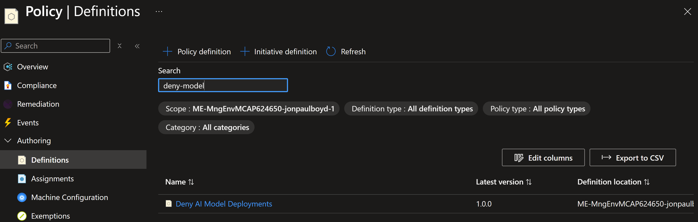
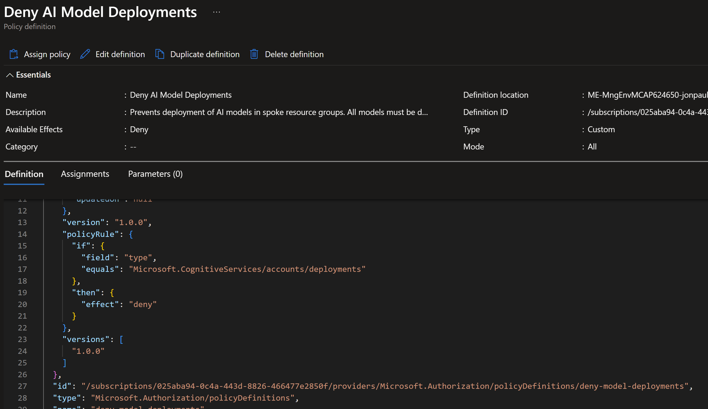
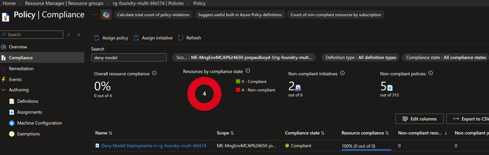

# Governance Policy: Deny Model Deployments in Spokes

## Why

In the hub/spoke architecture, all AI models are deployed centrally in the core resource group (`rg-foundry-core-*`) and exposed via APIM. If spoke teams could deploy their own models, you'd get fragmented costs, inconsistent content filters, and no unified observability.

The sections below describe what the policy does, where it applies, and how to inspect it in the portal; the notebook listed here deploys it end-to-end.

## Directory Contents

| File | Description |
|------|-------------|
| [06-01-deploy-governance-policy.ipynb](06-01-deploy-governance-policy.ipynb) | Defines and assigns the `deny-model-deployments` Azure Policy to spoke resource groups, blocking model deployment outside the hub |

---

## What It Does

Applies an Azure Policy (`deny-model-deployments`) to spoke resource groups that blocks any `Microsoft.CognitiveServices/accounts/deployments` resource creation. Spoke accounts can still **use** models via the APIM gateway — they just can't **deploy** new ones.

## Scope

| Resource Group | Policy |
|---|---|
| `rg-foundry-core-*` | Exempt — models live here |
| `rg-foundry-spoke-alpha-*` | Blocked |
| `rg-foundry-multi-*` | Blocked |

## View in Portal

- **Definition**: Policy → Authoring → Definitions → Custom → `deny-model-deployments`

- **Assignments**: Policy → Assignments, or navigate to a spoke RG → Policies

