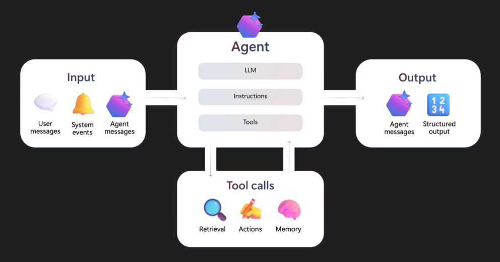
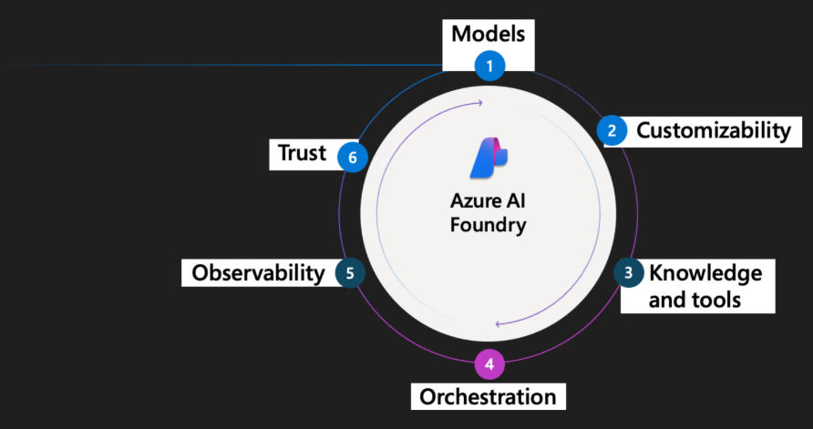

# What is an AI agent?

Agents make decisions, invoke tools, and participate in workflows.

An agent has three core components:

**Model (LLM):** Powers reasoning and language understanding.

**Instructions:** Define the agent's goals, behavior, and constraints. They can have the following types:

- Declarative:

    - **Prompt based:** A declaratively defined single agent that combines model configuration, instruction, tools, and natural language prompts to drive behavior.
        
    - **Workflow:** An agentic workflow that can be expressed as a YAML or other code to orchestrate multiple agents together, or to trigger an action on certain criteria.

- **Hosted:** Containerized agents that are created and deployed in code and are hosted by Foundry.

**Tools:** Let the agent retrieve knowledge or take action.

Agents receive unstructured inputs such as user prompts, alerts, images, or messages from other agents. They produce outputs in the form of tool results or messages. Along the way, they might call tools to perform retrieval or trigger actions.

# How do agents in Foundry work?
Think of Foundry as an assembly line for intelligent agents, to build agents that are secure, testable, and production ready.

- **1. Models**: Gives your agent its intelligence.

- **2. Customizability**: Customize agent with fine-tuned models or domain-specific prompts. Use data captured from real content and tool results.

- **3. Knowledge and tools**: Equip agents with tools to let it access enterprise knowledge (such as Bing, SharePoint, and Azure AI Search) and take real-world actions (via Azure Logic Apps, Azure Functions, OpenAPI, and more). 

- **4. Orchestration**: The agent needs coordination. Workflows orchestrate the full lifecycle, such as handling tool calls, updating conversation state, managing retries, and logging outputs.

- **5. Observability**: Test and monitor agents. Foundry can capture logs, traces, and evaluations. With Application Insights integration, teams can inspect every decision and continuously improve agents over time.

- **6. Trust**: Ensure that agents are suitable and reliable for the workload they're assigned to. Foundry applies enterprise-grade trust features, including identity via Microsoft Entra, role-based access control (RBAC), content filters, encryption, and network isolation.

# What runs an agent? — Foundry Agent Service

Foundry Agent Service is the **runtime** that executes agents. Your code never runs the agent loop directly — it submits requests via the SDK, and Agent Service handles thread state, tool dispatch, model invocation, retries, and content safety server-side.

When you call `responses.create(...)` against an agent reference, Agent Service:

1. Loads the agent version (system prompt, tools, model binding) from the project.
2. Persists the conversation thread and run — subsequent turns are resumable via `previous_response_id` without re-submitting context.
3. Calls the bound model through the project's APIM gateway (RBAC-scoped, no admin keys).
4. Dispatches tool calls — built-in tools (Code Interpreter, File Search, MCP) execute server-side; `FunctionTool` calls are returned for your code to execute (the basis for the [human-in-the-loop pattern](08-08-human-in-the-loop/)).
5. Streams output back as `output_item.delta` events while emitting OpenTelemetry spans for tracing.
6. Applies the project's content-safety filters on input and output.

What it isn't:

- **Not the model.** The model is a separate Azure OpenAI deployment that Agent Service calls; you bind a model to an agent at version-creation time.
- **Not a process you deploy.** For prompt agents, "the runtime" is the Agent Service request handler — there is no container or pod for the agent itself. ([Hosted Agents](08-03-hosted-agents/) are the exception — that pattern *does* deploy a container.)
- **Not a multi-agent orchestrator.** That's the Workflow Agents layer that sits on top of Agent Service.

See the [Agent Service overview](https://learn.microsoft.com/azure/ai-foundry/agents/overview) for full reference.

The labs in this directory put these building blocks into practice — agent versioning and tool use, hosted agents, memory, evaluation, observability, and human-in-the-loop:

# Directory Contents

| File | Description |
|------|-------------|
| [08-01-create-versioned-storytelling-agent.ipynb](08-01-create-versioned-storytelling-agent.ipynb) | Creating a versioned agent definition with `PromptAgentDefinition` and invoking it via the Responses API (storytelling persona) |
| [08-01b-create-versioned-contoso-wealth-agent.ipynb](08-01b-create-versioned-contoso-wealth-agent.ipynb) | Same versioning pattern, wealth-management variant — creates *Aria*, the Contoso Wealth research companion for senior investment counsellors |
| [08-02-create-agent-with-code-interpreter-tool.ipynb](08-02-create-agent-with-code-interpreter-tool.ipynb) | Adding the Code Interpreter tool to an agent so it can write and execute Python — e.g. generate plots from raw data |
| [08-03-hosted-agents/](08-03-hosted-agents/) | Containerised agent hosted by Foundry: deployment Bicep, the `mars-agent` sample, and the [hosted-agents quickstart](08-03-hosted-agents/hosted-agents-quickstart.md) |
| [08-04-agent-memory/](08-04-agent-memory/) | Persistent agent memory — [overview](08-04-agent-memory/08-04-00-agent-memory.md), deployment Bicep + notebook, and helpers for inspecting memory state |
| [08-06-agent-offline-evaluation/](08-06-agent-offline-evaluation/) | Pre-release agent evaluation against a curated test set — [overview](08-06-agent-offline-evaluation/08-06-00-agent-offline-evaluation.md), quality + RAI + agent-specific + custom evaluators, plus a full batch `evaluate()` run with portal logging |
| [08-07-agent-live-observability/](08-07-agent-live-observability/) | OpenTelemetry tracing, real-time observability, and continuous evaluation — [overview](08-07-agent-live-observability/08-07-00-agent-live-observability.md), [tracing](08-07-agent-live-observability/08-07-02-agent-tracing.md), [real-time observability](08-07-agent-live-observability/08-07-04-real-time-observability.md), plus observability and continuous-eval notebooks |
| [08-08-human-in-the-loop/](08-08-human-in-the-loop/) | Human-in-the-loop pattern — [overview](08-08-human-in-the-loop/08-08-00-human-in-the-loop.md) and `hitl.ipynb` walkthrough for pausing an agent for approval before tool execution |

# Resources
[Code Interpreter tool for Microsoft Foundry agents](https://learn.microsoft.com/en-us/azure/ai-foundry/agents/how-to/tools/code-interpreter?view=foundry&pivots=python)

[Publish and share agents in Microsoft Foundry](https://learn.microsoft.com/en-us/azure/ai-foundry/agents/how-to/publish-agent?view=foundry)

