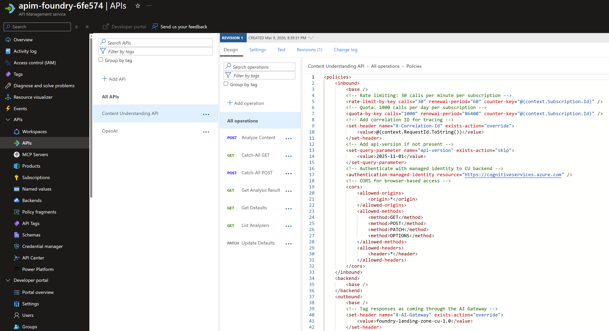

# 08 – Content Understanding Integration

Demonstrates integrating **Azure AI Content Understanding (CU)** into the hub/spoke
AI Foundry architecture via the APIM gateway. Rather than calling the CU service
directly, all CU traffic flows through the core APIM — giving operators centralised
rate limiting, quota enforcement, correlation tracing, and managed-identity backend
auth.

## What is the CU endpoint?

Content Understanding is a capability of an **Azure AI Services account**
(`kind: AIServices`), not a separate resource. It is accessible at:

```
https://{account}.cognitiveservices.azure.com/contentunderstanding/...
```

In this lab that account is `aif-cu-{suffix}`, deployed into `rg-foundry-cu-{suffix}`.
The APIM `/cu` API proxies to this endpoint via managed identity.

The account also hosts local deployments of `gpt-4.1-mini` and
`text-embedding-3-large` — these are required by CU field extraction analyzers,
which call them internally when extracting structured fields from documents. Without
these local deployments on the same account, field extraction analyzers will fail.

The `cu-project` Foundry project is a workspace layer on top of the account used to
hold the APIM connection. It plays no direct role in CU analysis.

```
Notebook / SDK client
        │
        │  api-key = CU_GATEWAY_KEY
        ▼
APIM /cu API  (apim-foundry-{suffix})       ← rate limit: 30/min, quota: 1000/day
        │
        │  authentication-managed-identity
        ▼
aif-cu-{suffix}  (AI Services account)
  ├── gpt-4.1-mini         ← local deployment for field extraction
  ├── text-embedding-3-large
  └── cu-project
        └── landing-zone-apim connection
```

## What it does

| Phase | Notebook | Actions |
|---|---|---|
| 0 – Deploy | `08-01-deploy-setup.ipynb` | Provisions `rg-foundry-cu-{suffix}`, `aif-cu-{suffix}`, model deployments, `cu-project`, APIM `/cu` API, RBAC; writes `CU_*` env vars to `.env` |
| 1 – Analyze | `08-02-cu-analyze.ipynb` | Lists available analyzers; submits the Apollo 14 Mission Report PDF via `prebuilt-layout`; polls for results; displays extracted markdown |

## Infrastructure deployed

| Resource | Type | Resource group |
|---|---|---|
| `rg-foundry-cu-{suffix}` | Resource Group | New — dedicated CU RG |
| `aif-cu-{suffix}` | AI Services account (Foundry) | `rg-foundry-cu-{suffix}` |
| `gpt-4.1-mini` | Model deployment (GlobalStandard, 10K TPM) | On `aif-cu-{suffix}` |
| `text-embedding-3-large` | Model deployment (Standard, 50K TPM) | On `aif-cu-{suffix}` |
| `cu-project` | Foundry project | Child of `aif-cu-{suffix}` |
| `landing-zone-apim` | Project connection (ApiManagement) | On `cu-project` |
| `content-understanding-api` | APIM API (`/cu`, 7 operations) | Core RG — `apim-foundry-{suffix}` |
| `foundry-gateway-cu` | APIM subscription (scoped to `content-understanding-api`) | Core RG |
| RBAC — deployer | Azure AI Developer on `aif-cu-{suffix}` | `rg-foundry-cu-{suffix}` |
| RBAC — `cu-project` MI | Azure AI Developer on `aif-cu-{suffix}` | `rg-foundry-cu-{suffix}` |
| RBAC — APIM MI | Cognitive Services User on `aif-cu-{suffix}` | `rg-foundry-cu-{suffix}` |

## APIM governance policy (`/cu` API)

The APIM API applies the following inbound policies to all CU traffic:

- **Rate limit:** 30 calls per minute per subscription
- **Quota:** 1,000 calls per day per subscription
- **Correlation ID:** `X-Correlation-Id` header injected for tracing
- **API version:** `api-version=2025-11-01` added if absent
- **Backend auth:** `authentication-managed-identity` — APIM MI authenticates to CU using Entra ID
- **CORS:** all origins allowed (browser-accessible)
- **Response tagging:** `X-AI-Gateway: foundry-landing-zone-cu-1.0`


See the policy below at the API level:



## Getting started

### 1. Prerequisites

- **Lab 1A complete** — `GATEWAY_URL` must be in `.env`
- **Lab 1C complete** — `MULTI_ACCOUNT` must be in `.env`
- **Azure CLI** — run `az login` with Contributor + User Access Administrator
- **Python environment** — run `uv sync` from repo root; select `.venv` kernel

### 2. Run the notebooks in order

| Notebook | Purpose |
|---|---|
| `08-01-deploy-setup.ipynb` | Deploy all infrastructure and write env vars (run once) |
| `08-02-cu-analyze.ipynb` | Analyze documents and poll results via APIM |

### 3. Env vars written to `.env`

| Variable | Description |
|---|---|
| `CU_ACCOUNT_ENDPOINT` | CU account cognitive services endpoint |
| `CU_FOUNDRY_PROJECT` | Project name (`cu-project`) |
| `CU_FOUNDRY_PROJECT_ENDPOINT` | Foundry project endpoint URL |
| `CU_APIM_CONNECTION` | APIM connection name on `cu-project` (`landing-zone-apim`) |
| `CU_GATEWAY_KEY` | Dedicated APIM subscription key for CU workload |
| `CU_RESOURCE_GROUP` | CU resource group (`rg-foundry-cu-{suffix}`) |

## Bicep files

| File | Deployed to | Purpose |
|---|---|---|
| `main.bicep` | `rg-foundry-cu-{suffix}` | AI Services account, model deployments, `cu-project`, APIM connection, deployer + project MI RBAC |
| `apim-cu-api.bicep` | Core RG (`rg-foundry-core-{suffix}`) | `/cu` APIM API with 7 operations and governance policy |
| `rbac.bicep` | `rg-foundry-cu-{suffix}` | Grants APIM managed identity `Cognitive Services User` on the CU account |

## Constraints and limitations

### Local model deployments required
Content Understanding field extraction analyzers depend on `gpt-4.1-mini` and
`text-embedding-3-large` being deployed locally on the same AI Services account.
The `deny-model-deployments` Azure Policy **must not** be assigned to
`rg-foundry-cu-{suffix}`. The hub/spoke architecture normally enforces this policy
on spoke RGs — the CU RG is the intentional exception.

### Two-resource-group deployment
The APIM API (`apim-cu-api.bicep`) is deployed into the **hub** RG, while the CU
account and project live in their own dedicated **CU** RG. `08-01-deploy-setup.ipynb`
orchestrates both deployments in sequence.

### Operation-Location URL rewriting required
After submitting an analysis (`POST /analyzers/{id}:analyze`), the CU service returns
an `Operation-Location` polling URL that points directly to
`cognitiveservices.azure.com` — bypassing APIM. The notebook rewrites this URL to
route through the APIM `/cu` gateway before polling, preserving governance controls.

### CU defaults must be patched post-deployment
The `gpt-4.1-mini` and `text-embedding-3-large` deployments are not automatically
configured as the CU service's default models. `08-01-deploy-setup.ipynb` Step 6
performs a `PATCH /defaults` call through the APIM gateway to bind them. The
`modelDeployments` body uses model name as both key and value (e.g.
`{"gpt-4.1-mini": "gpt-4.1-mini"}`). If this step is skipped, field extraction
analyzers that require LLM or embedding support will fail.

### APIM subscription creation requires management permissions
Step 5 of `08-01-deploy-setup.ipynb` creates the `foundry-gateway-cu` APIM
subscription via the ARM REST API. If the deployer lacks APIM management permissions,
this step fails. A fallback cell is provided to reuse `ALPHA_GATEWAY_KEY` instead.
The CU workload will still function but will share the Alpha subscription's
rate-limit bucket rather than having its own.

### RBAC propagation delay
After Step 4 deploys `rbac.bicep`, a 90-second wait is applied before verification.
Running `08-02-cu-analyze.ipynb` immediately after deployment without this wait may
produce `403 Forbidden` errors from the APIM managed-identity backend auth.

### IfMatchPreconditionFailed on redeploy
If you rerun Step 2 (Bicep deployment) after Step 5 has already patched the APIM
connection, ARM's incremental mode fails with an ETag mismatch. Delete the connection
using the commented-out teardown cell at the end of the notebook, then rerun Step 2.

### API version
The CU API version used throughout is `2025-11-01`. This is injected as a default by
the APIM policy if the client omits it. If Microsoft releases a new CU API version,
update the `set-query-parameter` policy value in `apim-cu-api.bicep` and redeploy.

### Analyzer availability varies by region
The `prebuilt-layout` analyzer used in `08-02-cu-analyze.ipynb` is available in all
supported regions. Other prebuilt analyzers (e.g. `prebuilt-videoSearch`) may not be
available depending on the region where `aif-cu-{suffix}` is deployed.

### No Foundry SDK path for CU
Azure AI Content Understanding is not yet surfaced through the `azure-ai-projects`
SDK. All CU calls use `urllib.request` (standard library) with the APIM key directly.
`DefaultAzureCredential` is only used for the deployment verification step (listing
project connections), not for CU analyze/poll calls.
